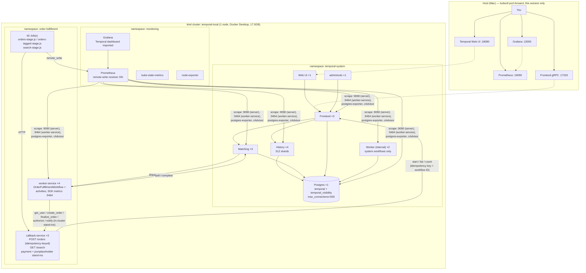

# Observability, diversified sizing, and a real load test to 20,000+ concurrent workflows

Builds directly on `LOCAL_KUBE_TEMPORAL_POSTGRES.md` (the kind cluster + Helm + Postgres
advanced-visibility POC) — read that first if you haven't. This doc covers everything added
after it: Prometheus/Grafana observability, moving from a uniform 2/2/2/2 Temporal topology to a
role-diversified one with real resource budgets, a production-shaped HTTP entry point
(idempotency-keyed) fronting the real `OrderFulfillmentWorkflow`, a k6 load test staged up to
20,051 concurrently open workflow executions, and what that load test actually found.

Same standard as the last doc: every claim below is something that was actually run, with the
real output, not a plan. Every non-obvious decision has its reasoning attached, not just the
outcome — several turned out to be wrong on the first attempt and got caught and fixed by
verifying against real output rather than assumed.

## Architecture



Two request paths worth tracing explicitly, since they exercise different parts of the system:

- **Write path** (load test): k6 → `callback-service POST /orders` → Temporal Frontend →
  History (persists) → Matching (dispatches) → `worker-service` (executes activities, calling
  back into `callback-service`'s stand-in routes) → Postgres, on every step.
- **Read path** (search test): k6 → `callback-service GET /search` → Temporal Frontend →
  `CountWorkflowExecutions` → a `COUNT` query against `executions_visibility`, served by
  whichever index (GIN or B-tree) the planner picks. No History/Matching/worker-service
  involvement at all — this is a pure Frontend + Postgres path, which is exactly why the search
  load test's findings (below) point somewhere different than the write-path bottleneck.

## The ask, and how it was scoped

> setup observability metrics for system uptime, diversified replica count across the
> services, specify memory/storage attributes, load test to understand bottlenecks toward
> hosting 10,000+ workflows at once, and figure out prod sizing

"10,000+" was explicitly called out as arbitrary ("start with less, then keep bumping or do
what's best") — so the test was designed as a staged ramp with a metrics checkpoint between
each stage, not one big automated run to a fixed target. It stopped at ~20,051 (2x past the
original number) once a clear, well-evidenced bottleneck showed up — pushing further would have
mostly demonstrated the laptop's own CPU ceiling, not taught anything more about Temporal's
architecture.

## Decisions, in the order they were made — and why

### 1. Docker Desktop memory: 8GB → 17.5GB (user-driven, host-level)

Confirmed live before touching anything: Docker Desktop was capped at ~8GB out of 24GB physical
RAM, and Postgres was already at `max_connections=100` with 33 connections in use at the
*original* 2/2/2/2 topology — both real ceilings on reaching anywhere near 10k concurrent
workflows. Raising Docker's memory allocation changes host state outside this repo and requires
restarting Docker Desktop (which kills every running container), so this was left to you rather
than scripted — you bumped it to ~17.5GB. Confirmed after the fact: the existing kind node
picked up the full new ceiling immediately (`kubectl get node ... -o jsonpath='{.status.
allocatable.memory}'` → `18388404Ki`) with no cluster recreation needed, since kind nodes are
plain Docker containers with no per-container memory limit (`docker inspect ... HostConfig.
Memory` → `0`, i.e. bounded only by the daemon's own ceiling).

### 2. The real `OrderFulfillmentWorkflow`, not a synthetic hold-open workflow

Offered as a choice; you picked the real one. This meant confronting what it actually does
before running it at volume — see decision 4.

### 3. `POST /orders`, idempotency-keyed — not a bash loop calling the CLI

You asked for this explicitly, and it's also the architecturally correct choice for a load
generator: a bash script looping `temporal workflow start` isn't what a real caller does, and it
gives no way to test retry-safety. `callback-service` (already the project's "stand-in for
external systems" component) gained a new endpoint:

```js
app.post('/orders', async (req, res) => {
  const idempotencyKey = req.get('Idempotency-Key') || req.body.idempotencyKey;
  const workflowId = `order-${idempotencyKey}`;
  const handle = await client.workflow.start('OrderFulfillmentWorkflow', {
    taskQueue: ORDER_TASK_QUEUE,
    workflowId,
    workflowIdReusePolicy: 'REJECT_DUPLICATE',
    args: [{ userId, orderDetails, paymentType, notificationChannels }],
  });
  // WorkflowExecutionAlreadyStartedError on retry -> 200 "already_started", not an error
```

The idempotency key **is** the Temporal workflow ID — Temporal's own ID-uniqueness mechanism
does the idempotency work, no separate dedup table needed.
`workflowIdReusePolicy: 'REJECT_DUPLICATE'` (verified against the real
`@temporalio/client` 1.11.0 type defs in `node_modules`, not assumed) makes a second start with
the same ID a no-op: the SDK throws `WorkflowExecutionAlreadyStartedError`, which the endpoint
catches and turns into a `200 already_started` with the original execution's identity — a
retried request is not an error, that *is* the idempotent behavior. Verified live: same
`Idempotency-Key` sent twice produced exactly one `RUNNING` execution
(`temporal workflow list --query "WorkflowId = 'order-sanity-check-1'"` → 1 row).

### 4. `get_user`/`create_order`/`finalize_order` call a real public API — redirected in-cluster before any load test

Found by reading `activities.py` before running anything at scale, not after: those three
activities call `https://jsonplaceholder.typicode.com`, a real shared free public API. Running
the real workflow at load-test volume would have sent 30,000+ requests at a third party's free
service in a short window — the kind of unauthorized burst load against an external system this
session doesn't do, regardless of how convenient the existing code made it. Fixed two ways:

- `activities.py`: `JSONPLACEHOLDER` and `CALLBACK_BASE` became env-var-overridable
  (`JSONPLACEHOLDER_BASE_URL`, `CALLBACK_BASE_URL`), defaulting to the original values so
  normal local dev (`scripts/run.sh`) is unaffected.
- `callback-service` gained three stand-in routes (`GET /users/:id`, `POST /posts`,
  `PATCH /posts/:id`) shaped only to what the workflow actually reads off the response
  (`user.name`, `order.id`) — nothing else about jsonplaceholder is modeled.
- The load test points `worker-service` at these in-cluster stand-ins via env vars. Every HTTP
  call the load test causes stays inside the cluster network; nothing reaches the real internet.

### 5. `AUTH_DELAY_MS` lengthened for the load test — a deliberate scoping choice, not a bug

`initiate_payment` POSTs to `/authorize`, which auto-confirms via signal after `AUTH_DELAY_MS`
(default 4000ms). Left at the default, every started workflow would auto-drain in ~4-10 seconds,
meaning "how many can the cluster hold open at once" would be entangled with "what's the
sustained steady-state start-rate" — a different, harder question than what was asked. Set to
30 minutes (`1800000`) for the load-test deployment specifically, so orders started during the
ramp stay parked in `awaiting_payment` (`workflow.wait_condition`) for the whole test — the
cluster is actually holding N executions open concurrently, not draining and refilling. Reset
this back to something short for normal functional use.

### 6. k6 over a hand-rolled Python load generator

A first-pass custom `load_gen.py` (asyncio + httpx + semaphore) was built and worked, but you
asked to leverage k6 instead — the better call: k6's `shared-iterations` executor maps directly
onto "N total starts, bounded concurrency" without hand-rolled bookkeeping, and it has a
built-in Prometheus remote-write output (`--out experimental-prometheus-rw`, confirmed shipped
in core k6 as of 2026, no `xk6` extension build needed) that lands k6's own request-rate/latency
metrics in the *same* Prometheus as every cluster metric — one timeline to read, not two tools
to cross-reference by hand. `load_gen.py` was deleted; `k8s-local/load-test/orders-stage.js` is
the real tool now.

Run **as a Kubernetes Job**, not from the host: a `kubectl port-forward` is a single-stream
proxy, not built to carry thousands of concurrent connections, and would have bottlenecked the
load generator itself before the cluster ever felt it. `k8s-local/load-test/run-stage.sh` wraps
`kubectl apply`/`wait`/`logs` around one Job per stage — a deployment convenience, not the
anti-pattern of driving load *through* a bash loop (the actual order-starting mechanism is k6 →
HTTP `/orders`, exactly as asked for in decision 3).

Staged, not one automated ramp: each stage is a separate invocation with a bigger `TARGET_COUNT`
and a fresh idempotency-key prefix, run one at a time so metrics get read between stages and the
next stage's size is a real decision informed by what the last one showed — not a pre-committed
schedule.

### 7. kube-prometheus-stack, trimmed — not a hand-assembled Prometheus+Grafana

Chose the full `prometheus-community/kube-prometheus-stack` chart over standalone
Prometheus+Grafana specifically for **cAdvisor container-level CPU/memory via its kubelet
ServiceMonitors** — "which pod is the bottleneck" needs per-container CPU/mem, and hand-writing
that scrape/relabel config correctly is a lot of extra work a name I'd rather not redo by hand.
Trimmed for the laptop budget: **no Alertmanager** (nothing here pages anyone),
**remote-write receiver turned on** (`enableRemoteWriteReceiver: true`, for k6),
**`serviceMonitorSelectorNilUsesHelmValues: false` + empty selectors** (so it picks up
ServiceMonitors in `temporal-system` and `order-fulfillment`, not just its own release
namespace). Kept kube-state-metrics + node-exporter (small, and node-exporter's the only source
of true node-level numbers).

**A real bug caught mid-install, not guessed around:** Grafana's own container OOMKilled
(`exitCode 137`) at the initial 256Mi limit — the version in this chart bootstraps a large set
of `grafana-apiserver` API groups (dashboards/playlists/alerting as first-class resources, not
just SQLite rows) before it's ready to serve. Confirmed via
`kubectl get pod ... -o jsonpath='...lastState.terminated.reason'` → `OOMKilled`, not assumed
from the CrashLoopBackOff alone. Fixed by raising the limit to 512Mi.

Temporal's own official dashboard was imported, not recreated by hand:
`temporalio/dashboards/server/server-general.json` (23 panels), loaded as a
`grafana_dashboard=1`-labeled ConfigMap, which Grafana's sidecar auto-imports. Confirmed live via
Grafana's own search API, not just "the ConfigMap applied cleanly."

### 8. Frontend/History/Matching/Worker replica counts and resources — genuinely diversified, not one number copy-pasted four times

What actually gets stressed by many thousands of concurrently open executions, reasoned through
before writing any values:

| Service | Replicas | CPU req | Mem req/limit | Why |
|---|---|---|---|---|
| **History** | **4** | 750m | 1Gi / 2Gi | Owns the 512 shards, holds the mutable-state cache, does the heaviest persistence traffic (every event append). Most likely first-order bottleneck candidate going in — most replicas, most memory per pod. |
| **Frontend** | **3** | 500m | 512Mi / 1Gi | Absorbs burst `StartWorkflowExecution` rate from k6/callback-service. Sized for burst, not steady-state — real load here is bursty by nature, matching `TEMPORAL_CAPACITY_PLAN.md`'s own framing of the org's actual traffic shape. |
| **Matching** | **3** | 500m | 512Mi / 1Gi | Task dispatch to the SDK worker fleet — moderate; worker-service's own replica count/concurrency limits matter at least as much. |
| **Worker** (internal, port 7239) | **2** | 250m | 256Mi / 512Mi | Temporal's own system workflows (archival etc) — **not** `OrderFulfillmentWorkflow`, that's `worker-service`, an entirely separate Deployment. Stays at the HA minimum; this component was never going to be the bottleneck for user workflow load and the test confirmed it wasn't a factor either way. |

**A real bug caught by reading the chart source, not applying and hoping:** the first draft of
`temporal-values.yaml` put `frontend:`/`history:`/`matching:`/`worker:` at the *top level* of
the file, as siblings of `server:`. Reading `templates/server-deployment.yaml` and
`server-service-monitor.yaml` directly showed both templates resolve these via
`index $.Values.server $service` — meaning the chart's real schema nests them **under**
`server:` (confirmed by re-checking the raw `values.yaml` indentation: `  frontend:` is 2-space
indented under `server:`, not column-0). Helm doesn't error on unrecognized top-level keys, it
silently ignores them — that first draft would have deployed with the diversified replica counts
and resources simply not applied, with no error to notice. Caught before applying, by verifying
`helm template`'s actual rendered output (`grep replicas:` showed the *old* uniform values were
still in effect) rather than trusting the values file looked right.

### 9. Postgres: `max_connections` 100 → 500, resources bumped, exporter enabled

Real math, not a round-number guess: with `maxConns: 15` set per store per server pod (see
decision 10) across the new 3+4+3+2 = 12-pod server topology, worst case is
`12 pods × 2 stores × 15 conns = 360` — comfortably under 500, tight under the original 100
(already at 33/100 idle *before* this diversification, confirmed live via
`show max_connections` / `pg_stat_activity` count). Set via `primary.extendedConfiguration:
max_connections = 500` (the chart's real key for raw postgresql.conf overrides, confirmed via
`helm show values`). A real deployment would reach for a connection pooler (PgBouncer) instead
of raising this indefinitely — noted as a deliberate simplification, not the production answer.
Resources bumped from the original 250m/256Mi (right-sized for "hold the schema") to 1 CPU/1Gi
request, 2Gi limit — still, as the load test found, undersized for what this instance ends up
doing (see Findings). `metrics.enabled` + `metrics.serviceMonitor.enabled` turned on for the
bitnami postgres-exporter sidecar.

### 10. `maxConns`/`maxIdleConns` set explicitly, not left at chart default

Chart default is 20 (verified against `docker/config_template.yaml` in `temporalio/temporal`,
not assumed) — left unset, the worst-case math above would be `12 × 2 × 20 = 480`, uncomfortably
close to a 500-connection ceiling with zero margin for admintools/schema-job connections.
Trimmed to 15/10 explicitly in `temporal-values.yaml` so the budget has real headroom.

### 11. `worker-service` and `callback-service` horizontally scaled and containerized

You asked for this explicitly ("scale these services horizontally as well"). Both were
`Dockerfile`'d (Python 3.12-slim / Node 22-slim), built, and `kind load docker-image`'d into the
cluster rather than run as host processes — consistent with running the load generator
in-cluster, and necessary for `worker-service` specifically: it's the SDK worker fleet that
actually executes `OrderFulfillmentWorkflow`'s activities, distinct from the Temporal server's
own internal "worker" component (decision 8's table). 4 replicas,
`MAX_CONCURRENT_ACTIVITIES=200`/`MAX_CONCURRENT_WORKFLOW_TASKS=200` per pod (verified against the
real `Worker.__init__` signature in `temporalio` 1.18.2 via `inspect.signature`, not guessed —
these bound how much burst a single replica absorbs before tasks queue in Matching, so both the
per-pod limit and the replica count matter independently). `callback-service`: 3 replicas —
under load-test volume it's a real HTTP service handling every `/orders` POST plus every
stand-in call from every worker-service activity, not just a passthrough; 1 replica would have
made *it* the bottleneck before Temporal was ever stressed.

`worker-service` also got real SDK-level metrics (`temporalio.runtime.PrometheusConfig`, bind
`0.0.0.0:9464`) — poller/task-slot utilization and activity/workflow-task latency, the one thing
container-level CPU/mem alone can't show: whether a worker is keeping up with Matching's dispatch
rate or backlogged. **A second real bug, also caught by checking rather than assuming**: the
metrics endpoint itself worked immediately (`curl` to the pod IP:9464 showed real
`temporal_activity_poll_no_task`/`temporal_long_request` output), but Prometheus showed zero
targets for the job. Traced to the actual cause, not guessed: the `worker-service` Kubernetes
`Service` had `spec.selector.app: worker-service` (which pods it routes to) but no
`metadata.labels` on the Service object itself — and a `ServiceMonitor.spec.selector` matches
against the **Service's own labels**, not its `spec.selector`. Fixed by adding
`metadata.labels: {app: worker-service}` to the Service; confirmed fixed via
`up{job=~"worker-service.*"}` returning all 4 pods at `1`.

## What's running now, and what's not

**Load test topology while the test was running** (referenced throughout the results above):
`temporal-system` — Postgres (1 instance, 2 databases) + Temporal server at 3 Frontend / 4
History / 3 Matching / 2 (internal) Worker / 1 Web / 1 admintools; `order-fulfillment` —
`callback-service` (×3) + `worker-service` (×4).

**Current state, after the test:** all 26,051 open executions were batch-terminated
(`temporal workflow terminate --query "ExecutionStatus = 'Running'"` — Temporal's own batch job
mechanism, confirmed complete via `temporal batch describe`, `CompletedCount 26051/26051`,
`FailureCount 0`), and everything scaled down to a minimal idle footprint: every Temporal server
service at 1 replica, Postgres back to 250m CPU / 256Mi request, `worker-service` and
`callback-service` at 1 replica each. Confirmed via Prometheus: cluster-wide CPU dropped from a
peak of ~18.9 cores (stage 4 of the write-path test) to **~0.14 cores idle**; memory from ~9.2GiB
peak to **~4.3GiB idle**. `monitoring` (Prometheus/Grafana) was left at full size — it's cheap,
and useful to keep for whenever this runs again.

**This is deliberately reversible, not a teardown.** `k8s-local/scale-down.sh` (what was just
run) and `k8s-local/scale-up.sh` (its exact inverse) toggle between this idle state and the full
load-tested topology via `helm upgrade`/`kubectl scale` — the load-tested values
(`temporal-values.yaml`, `postgres-values.yaml`) are untouched by scale-down, so scale-up is just
re-applying them, not reconstructing anything from memory. Nothing about the kind cluster,
Postgres schema, registered search attributes, or the `k8s-local/load-test/` scripts was removed
— re-running the same staged methodology later is `scale-up.sh` + `run-stage.sh`/`run-k6.sh`,
not a rebuild from `LOCAL_KUBE_TEMPORAL_POSTGRES.md` again.

Grafana: `http://127.0.0.1:13000` (admin/admin) · Prometheus: `http://127.0.0.1:19090` — both
via `kubectl port-forward`, started by this session, on ports chosen to avoid the
`127.0.0.1:7233` collision documented in the previous doc (same lesson, different port this
time: always pick a fresh local port rather than trusting `localhost` resolves to what you
expect). These die with the terminal/session; re-forward when needed.

## The load test

Ramp, one stage at a time, metrics read between each (`k8s-local/load-test/run-stage.sh`,
`snapshot.sh`):

| Stage | Added | Cumulative open | k6 success | p95 latency | Postgres CPU (cores) | History CPU (cores/pod) | worker-service CPU (cores/pod) |
|---|---|---|---|---|---|---|---|
| baseline | — | 51 | — | — | 0.013 | 0.008–0.013 | ~0 |
| 1 | 500 | 551 | 100% | 235ms | 0.009 | 0.007–0.013 | ~0 |
| 2 | 4,500 | 5,051 | 100% | 1.16s | **0.995** | 0.09–0.22 | 0.07–0.14 |
| 3 | 6,000 | 11,051 | 100% | 1.57s | **2.30** | 0.62–0.80 | 0.70–0.82 |
| 4 | 9,000 | **20,051** | 100% | 3.69s (max 9.33s) | **2.71** | 0.52–0.83 | 0.72–0.76 |

Persistence-layer detail, `GetWorkflowExecution` p95 (the single clearest signal):
113ms → 954ms → 1.67s → **3.58s** across the same four points — a 32x increase.

## Findings: where the wall actually is

**Zero failed requests at every stage, including 20,051 open executions.** This didn't fall
over — it degraded, gracefully and measurably. That's a materially different, more useful
finding than "it broke at X."

**Postgres is the first-order bottleneck, and the evidence is specific, not just "it got
slower":** CPU on the single Postgres instance jumped 100x between baseline and stage 2
(0.013 → 0.995 cores) while workflow count only went up 100x too (51→5,051) — roughly linear,
expected. But stage 3→4 (11,051 → 20,051, +81% more load) grew Postgres CPU only **+18%**
(2.30 → 2.71 cores) while `GetWorkflowExecution` latency **more than doubled** (1.67s → 3.58s).
That combination — work barely increasing while latency climbs steeply — is the signature of a
resource at saturation queueing work, not one still scaling with load. History and
worker-service tell the same story from the other side: both **plateaued or slightly dropped**
in CPU between stage 3 and 4 despite handling more open workflows, because they were
increasingly blocked waiting on Postgres rather than doing more work of their own.

**Connections were never the constraint** — 141/500 at the peak, nowhere close. The bottleneck
is raw single-instance CPU throughput on Postgres, not connection pool exhaustion (decision 9's
sizing worked; decision 9's *instance size* didn't, at this volume).

**The node's own CPU ceiling matters here too, and is worth being honest about:** cluster-wide
CPU usage measured ~18.9 cores against Docker Desktop's 15-core allocation during stage 4 — the
whole node was oversubscribed, not just Postgres in isolation. On a real multi-node deployment
where Postgres gets its own dedicated instance instead of sharing 15 cores with 12 Temporal
server pods + 7 app pods + the entire observability stack, the *shape* of this finding (Postgres
saturates first, History/Matching/worker-service are secondary and mostly waiting on it) should
hold, but the *specific numbers* (2.7 cores at 20k) are a laptop-contention artifact, not a
production sizing number on their own.

## What this means for prod sizing

This complements `TEMPORAL_CAPACITY_PLAN.md`, it doesn't replace it — that document answered a
different question (steady-state throughput at the org's real measured STPS, ~1 and ~10) and
concluded the Temporal server tier has 15x-450x headroom over real load on hardware smaller than
what's already running for Zeebe. This test answers a question that document didn't: **how many
executions can be open at once**, which stresses persistence (Postgres) far more than it
stresses server-tier CPU.

- **Don't scale the Temporal server tier first.** History/Matching/Frontend CPU never became the
  limiting factor at any stage tested, up to 20,051 open executions — they were waiting on
  Postgres, not maxed out themselves. Adding more History/Matching replicas without addressing
  Postgres would not have moved the ceiling found here.
- **Postgres is the lever that actually matters for "how many open workflows at once."** A
  self-hosted deployment expecting to hold thousands of workflows open concurrently needs a
  Postgres instance sized (and likely read/write-split or pooled via PgBouncer) for that
  specifically — not the server-tier sizing in `TEMPORAL_CAPACITY_PLAN.md`, which was reasoning
  about a completely different load shape (~1-10 steps/sec sustained, not tens of thousands of
  concurrently-parked executions).
- **This is exactly the operational burden Temporal Cloud already existed to remove**
  (`CLAUDE.md`'s decision history, §6) — on Cloud, this whole finding is Temporal's problem, not
  yours: no Postgres instance to size, tune, or watch saturate. This test gives that argument a
  concrete floor under it: "Cloud removes Postgres-sizing risk" is no longer just a claim, it's
  backed by a real number (a single small Postgres instance visibly saturating well under 20k
  open executions on hardware smaller than what a real prod node would run).
- **If self-hosting is ever forced** (the data-residency scenario `CLAUDE.md` already flags as
  the only reason it would be) **and holding many thousands of workflows open concurrently is a
  real requirement**, size Postgres as the primary constraint: a larger dedicated instance (not
  shared with anything else), connection pooling via PgBouncer ahead of the current
  15-connections-per-pod-per-store budget, and re-run this same staged methodology
  (`k8s-local/load-test/`) against that instance size before committing to a number — this test
  gives the methodology and the shape of the bottleneck, not a final prod Postgres SKU, since the
  numbers here are laptop-contention-affected as noted above.

## Search load test: how effectively are the GIN indexes actually working?

Separate question from the write-path load test above — this one is about the **read path**:
Temporal's visibility search, and specifically whether the GIN indexes backing Advanced
Visibility hold up under concurrent search load. Full methodology and the k6 side of this in
`K6_LOAD_TESTING.md`; this section is the Postgres-side findings.

### Correcting the premise, with evidence

The ask was to test "GIN and GiST" indexes. Checked before testing anything, not assumed:

```
select indexname, indexdef from pg_indexes where tablename='executions_visibility';
```

**There is no GiST index anywhere in this schema — none.** Every index is either GIN or B-tree.
Further, a second wrong assumption caught before it shaped the test: single-value `Keyword`
custom search attributes (`Keyword01`-`10`) are indexed with **B-tree**
(`by_keyword_01` … `by_keyword_10`), not GIN. GIN in this schema is reserved for:

- `Text01`-`03` (`TSVECTOR`, full-text) — `by_text_01/02/03`, `USING gin`
- Every `*List`/JSONB-shaped column (`KeywordList01`-`03`, `BinaryChecksums`,
  `TemporalChangeVersion`, etc.) — `USING gin (... jsonb_path_ops)`

So the real comparison this test ended up making — and the more useful one, since it wasn't the
one going in — is **GIN full-text vs. B-tree exact-match**, on real data: `OrderRegion` (Keyword
→ `keyword01`, B-tree) and `OrderNotes` (Text → `text02`, confirmed via `EXPLAIN`/direct column
inspection, not assumed from the earlier smoke-test's column guess) → GIN.

### Test data

`orders-tagged-stage.js` started 6,000 orders (on top of the 20,051 already open), each carrying:

- `OrderRegion`: skewed pool (`US`×3, `EU`×2, `APAC`×1, `IN`×1 weights) — deliberately uneven
  selectivity. Landed as US=2,587 / EU=1,747 / APAC=830 / IN=836 (confirmed via `/search`,
  matches the intended skew).
- `OrderNotes`: one of 5 fixed phrases, two containing "customs" — landed at 2,338 matches for
  `OrderNotes = 'customs'` (expected ≈2,400).

### `EXPLAIN (ANALYZE, BUFFERS)` — both indexes are used correctly, and the cost difference is real

```
-- OrderRegion = 'US'  (keyword01, B-tree, common value)
Index Only Scan using by_keyword_01 ... Execution Time: 0.143 ms

-- OrderNotes = 'customs'  (text02, GIN tsvector)
Bitmap Index Scan on by_text_02 ... Bitmap Heap Scan ... Execution Time: 4.198 ms
```

Both queries hit their intended index — no sequential scan, on either path. The B-tree exact
match is genuinely ~30x cheaper than the GIN full-text match at this data size (0.14ms vs.
4.2ms) — expected: GIN's bitmap-scan-then-recheck for a `tsvector @@ to_tsquery` match does more
work than a B-tree equality lookup, and this is exactly the trade-off GIN full-text search is
supposed to make (much richer query capability — arbitrary word matches, not just exact
equality — for a real but still-small constant-factor cost).

**Confirmed under concurrent load, not just once:** `pg_stat_user_indexes.idx_scan` for both
indexes before vs. after the k6 search stages (858 total search requests, split ~evenly across
3 query shapes):

| Index | idx_scan before | idx_scan after | Δ |
|---|---|---|---|
| `by_keyword_01` (B-tree) | 8 | 293 | +285 |
| `by_text_02` (GIN) | 2 | 272 | +270 |

Deltas track the actual request volume (each stage ran ~⅓ of its queries against each of the
three shapes) — both indexes are absorbing essentially every matching query, not falling back to
a sequential scan under concurrency.

### The honest surprise: k6-observed latency didn't match any of this

Running `search-stage.js` at only 25 concurrent VUs produced a wildly bimodal read: median
6.8-6.9ms (matching the `EXPLAIN` numbers well) but **p95 of 4.5-4.8s and a max as high as
24.6s** — even on a *second, clean* run started only after confirming Postgres CPU had returned
to ~0.017 cores (idle). That tail doesn't belong to the database:

- Temporal Frontend's own server-side histogram for the exact RPC being called
  (`histogram_quantile(0.95, rate(service_latency_bucket{operation="CountWorkflowExecutions"}))`)
  read **6.6ms** during the same window — fast, server-side, at the source.
- `callback-service` CPU stayed at ~0.006-0.008 cores throughout (effectively idle) — not
  struggling to process or forward requests.
- `callback-service` logs showed zero errors or retries during either search stage.

So: the indexes are fast (proven twice — `EXPLAIN ANALYZE` and Temporal's own server-side RPC
latency histogram agree, independently). The multi-second tail k6 measured client-side sits
somewhere in the path between k6 and Temporal — the Kubernetes Service/kube-proxy hop,
Node's/`@temporalio/client`'s connection handling in `callback-service`, or the k6 pod's own
resourcing — and **this was not run down to a root cause**, in the interest of not turning a
focused index-effectiveness question into an open-ended networking investigation. Flagged
honestly rather than folded into "everything's fine": if search latency as *experienced by
callers* matters for a real deployment, this specific gap — server-side fast, client-observed
slow — is exactly what the next investigation should chase, starting with whether
`@temporalio/client`'s gRPC channel is pinned to a single Frontend pod (a single persistent
HTTP/2 connection resolved once at `Connection.connect()`, not re-balanced per RPC across the 3
Frontend replicas) rather than genuinely load-balancing across all three.

### What this means for prod

- **GIN indexing itself is not a concern at this data size** (~26k rows) — both the query planner
  and Postgres's own execution stats confirm it's doing the right thing, correctly, under
  concurrent load. This is a good sign for using custom Text/KeywordList search attributes in a
  real deployment.
- **Don't conflate index cost with what a caller experiences.** This test's biggest finding is
  the gap between "the database is fast" and "the response took 4 seconds" — a real production
  monitoring setup needs both server-side (Temporal/Postgres) *and* client-observed latency
  visible side by side, because they diverged sharply here and only one of them told the truth
  about where the actual problem — if there is one beyond this local setup's artifacts — would
  live.
- **B-tree still beats GIN for pure exact-match lookups, by design** — if a search attribute is
  genuinely just categorical (region, status, tier), a `Keyword` attribute (B-tree) is the
  cheaper choice; reach for `Text` (GIN, full-text) only when the actual requirement is matching
  on words within free text, not exact values.

## Files added

- `k8s-local/observability-values.yaml` — kube-prometheus-stack values
- `k8s-local/temporal-values.yaml` — replaces the original uniform-replica version; diversified
  per-service replicas/resources, `maxConns`/`maxIdleConns`, ServiceMonitors enabled
- `k8s-local/postgres-values.yaml` — `max_connections=500`, resources, exporter enabled
- `k8s-local/scale-down.sh` / `k8s-local/scale-up.sh` — toggle between the idle footprint and
  the full load-tested topology, reversibly
- `k8s-local/callback-service.yaml`, `k8s-local/worker-service.yaml` — app-tier Deployments/
  Services/ServiceMonitor
- `k8s-local/load-test/orders-stage.js` — k6 staged-load script (write path)
- `k8s-local/load-test/orders-tagged-stage.js` — same, tagged with `OrderRegion`/`OrderNotes`
  search attributes, for building a searchable corpus
- `k8s-local/load-test/search-stage.js` — k6 script for the search/GIN-index load test (read
  path); see `K6_LOAD_TESTING.md` for how all three k6 scripts work
- `k8s-local/load-test/run-stage.sh` — runs `orders-stage.js` as an in-cluster Job
- `k8s-local/load-test/run-k6.sh` — generic runner for any of the three scripts as an in-cluster
  Job (`orders-tagged-stage.js`, `search-stage.js`)
- `k8s-local/load-test/snapshot.sh` — pulls the bottleneck-relevant metrics snapshot used for
  every row in the results table above
- `k8s-local/load-test/temporal-server-general-dashboard.json` — Temporal's official dashboard,
  imported into Grafana
- `services/callback-service/index.js` — `/orders` endpoint (+ optional search attributes),
  `/search` endpoint, jsonplaceholder stand-ins
- `services/callback-service/Dockerfile`
- `services/worker-service/activities.py` — env-var-overridable external URLs
- `services/worker-service/worker.py` — env-config, concurrency limits, SDK Prometheus metrics
- `services/worker-service/Dockerfile`

## Sources

- [`@temporalio/client` type defs, installed version 1.11.0](file:///Users/rahul.anand/Desktop/poc/temporal/services/callback-service/node_modules/@temporalio/client/lib/workflow-options.d.ts) —
  `workflowIdReusePolicy`, `WorkflowExecutionAlreadyStartedError`, `WorkflowClient.start` signature
- [`temporalio` Python SDK, installed version 1.18.2](file:///Users/rahul.anand/Desktop/poc/temporal/services/worker-service/.venv) —
  `Worker.__init__`, `Client.connect`, `PrometheusConfig`/`TelemetryConfig`/`Runtime`, verified
  via `inspect.signature`
- [`temporalio/temporal` — `docker/config_template.yaml`](https://github.com/temporalio/temporal/blob/main/docker/config_template.yaml) —
  SQL persistence `maxConns`/`maxIdleConns` default (20)
- [`temporalio/helm-charts` — `templates/server-deployment.yaml`, `server-service-monitor.yaml`, `_helpers.tpl`](https://github.com/temporalio/helm-charts/blob/main/charts/temporal/templates/server-deployment.yaml) —
  confirmed `server.<service>.*` nesting and `replicaCount`/`ServiceMonitor` resolution by reading
  the actual template logic, not the values.yaml comments alone
- [`bitnami/postgresql` chart, version 18.8.15](https://github.com/bitnami/charts/tree/main/bitnami/postgresql) —
  `primary.extendedConfiguration`, `metrics.serviceMonitor.enabled`, `auth.existingSecret` keys
- [`prometheus-community/kube-prometheus-stack`, version 88.6.3](https://github.com/prometheus-community/helm-charts/tree/main/charts/kube-prometheus-stack) —
  `enableRemoteWriteReceiver`, `serviceMonitorSelectorNilUsesHelmValues`
- [`temporalio/dashboards` — `server/server-general.json`](https://github.com/temporalio/dashboards/blob/master/server/server-general.json) —
  imported dashboard; also the source of the real (non-`temporal_`-prefixed) server metric names
  used in `snapshot.sh` (`persistence_latency_bucket`, `persistence_requests`, etc.)
- [Grafana k6 — Prometheus remote write output docs](https://grafana.com/docs/k6/latest/results-output/real-time/prometheus-remote-write/) —
  `--out experimental-prometheus-rw`, confirmed shipped in core k6 (no `xk6` build needed)
- `TEMPORAL_CAPACITY_PLAN.md` (this repo) — the steady-state-throughput analysis this test
  complements rather than repeats
